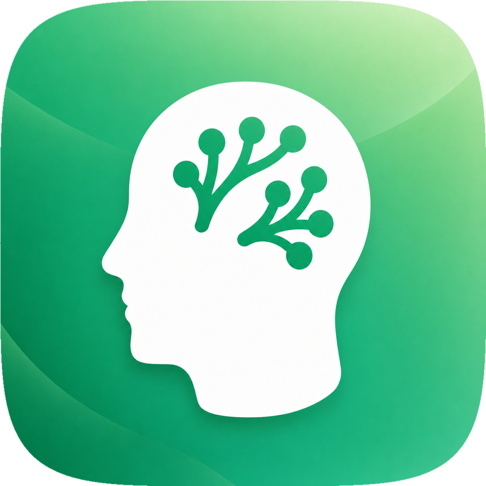
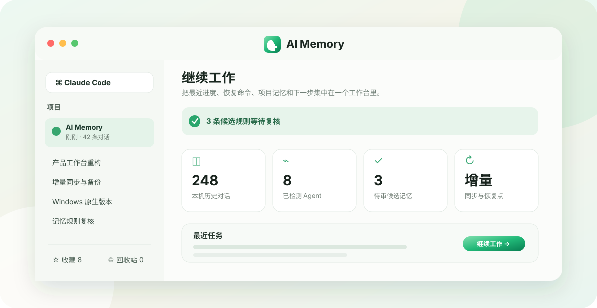
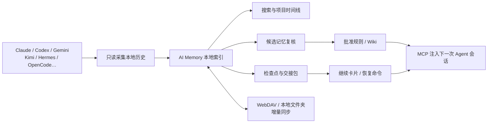
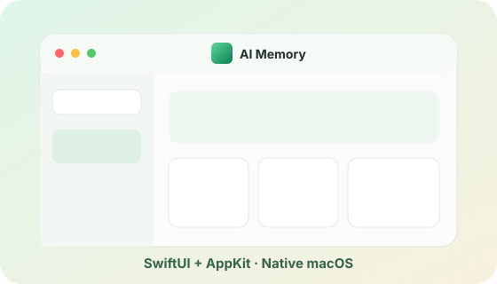
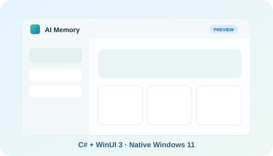

<div align="center">
  

  # AI Memory

  **让每一个 AI Agent 都记得你的项目，也让每一次工作都能从上次停下的位置继续。**

  本地优先的 AI 对话历史、项目记忆、检查点、交接与跨设备同步工作台。

  [](#macos)
  [](#windows-11)
  [](./docs/ARCHITECTURE.md)
  [](./Windows/README.md)
  [](./LICENSE)

  <br>
  
</div>

## AI Memory 是什么？

AI 编程工具越来越多，但上下文仍然被困在各自的窗口、会话和电脑里。换一个 Agent、关闭一个终端、隔几天再回来，模型往往已经不知道：

- 这个项目做到哪里了；
- 哪些方案试过并失败了；
- 哪些规则已经被团队确认；
- 下一步应该执行什么命令；
- 哪个会话包含真正需要继续的上下文。

AI Memory 不是另一个聊天客户端。它是一层位于本地 AI 工具之上的**长期记忆与工作接续层**：读取本机已有的 Agent 历史，把对话整理为可搜索证据，再将稳定知识沉淀为规则、检查点、Wiki 和交接包，最后通过桌面应用与 MCP 把这些上下文带回下一次会话。

| 常见断点 | AI Memory 的处理方式 |
| --- | --- |
| 找不到昨天的关键对话 | 跨来源搜索、按项目和电脑归组、历史详情直达 |
| 换 Agent 后上下文清零 | 生成继续卡片、迁移会话、MCP 提供项目上下文 |
| 重要经验散落在聊天里 | 候选记忆复核、编辑、批准、冲突处理与停用 |
| 一次失败尝试反复重做 | 记录运行、产物、经历、检查点和交接 |
| 多台电脑历史不一致 | WebDAV 或本地云盘目录进行增量双向同步 |
| 担心上传隐私数据 | 本地 SQLite、系统凭据库、显式同步配置 |

## 一次完整的工作接续



## 核心能力

### 统一历史工作台

- 聚合 Claude Code、Codex、Gemini CLI、Google Antigravity、OpenCode、ZCode、Hermes、Kimi Code 等本地历史；
- 每次打开应用都会自动检测并增量导入本机已有记录，无需先手动扫描或刷新；
- 同时覆盖 Factory Droid、Mistral Vibe、Amazon Q Developer、GitHub Copilot CLI、Qwen Code、Goose、Cline、Roo Code、OpenHands、Aider、Crush、Kilo Code 等主流 Agent 与 CLI；
- 检测 165 种 Agent、通用 AI CLI 与本地模型 CLI；除主流编码 Agent 外，还覆盖 Hugging Face CLI、Microsoft 365 Agents Toolkit、GitHub Agentic Workflows、Neovate、VT Code、Dexto、xAI Grok Build / Grok CLI、nanobot、ZeroClaw、PicoClaw、IronClaw、NullClaw、Moltis、OpenSquilla、Qodo、CodeRabbit、Poolside、Command Code、Ante、Mentat、Claw Code、Coro、Nori、CodeMachine、Open Codex、Groq Code CLI、Devon、g3、Mini-Kode、zot、VibePod、Every Code、Claw Code Agent、Gitagent、OpenDev、QodeX、ClawCodex、Tutti、acpx、cmux、muxd、muxel、Flowmux、MCPJam、Zenflow、Void、Ruflo / Claude Flow、Claurst、agentty、Herdr、Smol Developer、Claude Engineer、Free Code、ForgeCode、AutoCodeRover、Agentless、Codel、openHarness、Octomind、Codex Infinity、San、Waveloom、picocode、QQCode、Keen Code、Smelt、Grinta、Zap、Binharic、Darce、CLAII、NanoClaw、Clawith、claw0、GitClaw、LionClaw、FetchCoder、Crab Code、OpenAgent、DvalinCode、LettaBot、oh-my-openagent、Ollama 与 LM Studio CLI 等工具；
- 已安装且存在可读数据的来源优先显示，未安装来源不会自动启用；
- 按电脑、项目和更新时间组织对话，支持搜索、筛选、排序、折叠和批量操作；
- 收藏重要会话，添加备注、标签和置顶，并生成可复制的继续卡片。
- 迁移目标按本机实际检测到的 Agent/CLI 动态生成；Kimi Code 与 Claude、Codex、Gemini、OpenCode 支持写入后回读验证，只读格式会明确标记。

### 可治理的项目记忆

- 从真实会话证据生成候选记忆；
- 支持编辑批准、拒绝、暂缓、冲突检查、规则停用和重新复核；
- 管理项目规则、Wiki、实体关系与新鲜度；
- 所有记忆动作写入真实数据库，不以静态卡片或模拟数据伪装成功。

### 检查点、交接和跨 Agent 接续

- 保存工作目标、已完成事项、下一步、相关文件和恢复命令；
- 将检查点提升为交接包，并记录目标 Agent 与消费状态；
- 运行、产物和经历可以回到对应的原始对话；
- MCP helper 可为新的 Agent 会话提供项目上下文、历史检索和记忆生命周期工具。

### 增量同步、备份与恢复

- WebDAV 和本地文件夹同步只上传、下载发生变化的记录；
- 内容哈希与时间戳共同参与合并，未变化记录直接跳过；
- 备份复用未变化文件，避免重复复制整个数据库；
- 迁移、导入和恢复前保护原始数据，失败不会用损坏文件替换现有数据库；
- WebDAV 密码保存在 macOS Keychain 或 Windows Credential Locker。

### 原生桌面体验

- macOS 使用 Swift 6、SwiftUI、AppKit、SQLite、Keychain 与 Apple 官方 Framework；
- Windows 使用 C#、WinUI 3、Windows App SDK、SQLite、PasswordVault，并通过 EXE 安装程序部署 WinUI 包；
- 桌面 GUI 保持单实例，重复启动会恢复现有窗口；
- 设置、关于、更新检查、状态栏/系统托盘和快捷键遵循各自平台习惯。
- macOS 26 及以上使用系统 Liquid Glass；较早系统自动使用原生材质回退。

## 双平台

<table>
  <tr>
    <td width="50%" align="center">
      
      <h3 id="macos">macOS</h3>
      <p><strong>原生版本 · 当前主要实现</strong></p>
      <p>Swift 6 · SwiftUI · AppKit · macOS 14+</p>
      <p>已完成本地历史、记忆治理、迁移、增量同步、备份恢复、MCP、菜单栏和单实例体验。</p>
    </td>
    <td width="50%" align="center">
      
      <h3 id="windows-11">Windows 11</h3>
      <p><strong>原生版本 · v0.1.3</strong></p>
      <p>C# · WinUI 3 · Windows App SDK · EXE 安装程序</p>
      <p>已完成原生工作台、Agent/CLI 自动导入与集成、迁移、增量同步、备份恢复、MCP、Mica、通知区域和单实例体验。</p>
    </td>
  </tr>
</table>

### 下载

- **macOS 14+（Apple silicon 与 Intel）**：[下载 AI Memory 0.1.3](https://github.com/douxy1994/AI-Memory/releases/download/v0.1.3/AI-Memory-0.1.3-macOS-universal.dmg)
- **Windows 11 x64**：[下载 AI Memory 0.1.3 EXE 安装程序](https://github.com/douxy1994/AI-Memory/releases/download/v0.1.3/AI-Memory-0.1.3-Windows-x64-Setup.exe)。

两个平台的安装包和 SHA-256 校验文件均发布在 [v0.1.3 Release 页面](https://github.com/douxy1994/AI-Memory/releases/tag/v0.1.3)。Windows 安装程序会注册 WinUI 包身份，因此通知区域、登录启动和 MCP 等系统集成功能与已验收版本一致。

## 数据与隐私

AI Memory 默认将数据保存在本机：

| 平台 | 默认数据目录 | 凭据 |
| --- | --- | --- |
| macOS | `~/Library/Application Support/AIMemory` | Keychain |
| Windows 11 | `%LOCALAPPDATA%\AIMemory` | Credential Locker |

读取 Agent 历史时以只读为默认；只有明确执行迁移、删除、集成安装或同步时，才会修改对应目标。ChatMem 数据导入会先校验和备份，AI Memory 与 ChatMem 的数据目录始终独立。详见[数据与隐私](./docs/DATA_AND_PRIVACY.md)。

## 从源码构建

### macOS

要求 Xcode 26 或更新版本、macOS 14+。仓库已包含生成后的 Xcode 工程：

```bash
xcodebuild \
  -project AIMemory.xcodeproj \
  -scheme AIMemory \
  -configuration Debug \
  -destination 'platform=macOS' \
  -derivedDataPath .build/DerivedData \
  test
```

构建并启动本机应用：

```bash
./script/build_and_run.sh
```

### Windows 11

要求 Visual Studio 的 **Windows application development** 工作负载、Windows 11 SDK 与 .NET 10：

```powershell
pwsh ./Windows/scripts/verify.ps1
```

更完整的开发环境、目录和验证说明见[开发指南](./DEVELOPMENT.md)与[Windows 说明](./Windows/README.md)。

## 项目结构

```text
AIMemory/
├── AIMemory/                 # macOS SwiftUI + AppKit 应用
├── AIMemoryMCP/              # macOS 原生 MCP helper
├── AIMemoryTests/            # macOS 单元与数据兼容测试
├── Windows/
│   ├── src/AIMemory.Core/    # 跨 UI 的 Windows 核心数据层
│   ├── src/AIMemory.Windows/ # WinUI 3 桌面应用
│   ├── src/AIMemory.Mcp/     # Windows MCP helper
│   └── tests/                # Windows 核心测试
├── docs/                     # 架构、功能矩阵、隐私和迁移说明
└── script/                   # 本机构建与验证脚本
```

## 来源与致谢

AI Memory 来源于 [Rimagination/ChatMem](https://github.com/Rimagination/ChatMem)。原项目提出并实现了本地优先的 AI 编程记忆、Agent 历史迁移、项目上下文和 MCP 接续方向。

本仓库在该基础上进行了**完整重构与功能更新**：

- macOS 客户端由原跨平台界面重写为 SwiftUI + AppKit 原生应用；
- Windows 客户端以 C# + WinUI 3 + Windows App SDK 独立实现；
- 数据层、同步、迁移、备份、权限、窗口、菜单与异常反馈按原生平台重新设计；
- 扩展 Agent/CLI 检测、本地历史读取、记忆治理、检查点、交接和增量同步；
- AI Memory 使用独立名称、Bundle ID、数据目录和凭据空间，不覆盖 ChatMem。

感谢 Rimagination 与 ChatMem 贡献者建立的产品基础。本仓库现按 [GNU Affero General Public License v3.0](./LICENSE) 发布。更详细的演进边界见[项目来源与迁移](./docs/ORIGIN_AND_MIGRATION.md)。

## 文档

- [架构设计](./docs/ARCHITECTURE.md)
- [功能矩阵](./docs/FEATURE_MATRIX.md)
- [数据与隐私](./docs/DATA_AND_PRIVACY.md)
- [项目来源与迁移](./docs/ORIGIN_AND_MIGRATION.md)
- [开发与验证](./DEVELOPMENT.md)
- [Windows 原生版本](./Windows/README.md)

## License

Copyright © 2026 douxy1994

AI Memory is licensed under the [GNU Affero General Public License v3.0
(AGPL-3.0-only)](./LICENSE). See [NOTICE.md](./NOTICE.md) for the complete
project copyright and third-party attribution notice.
