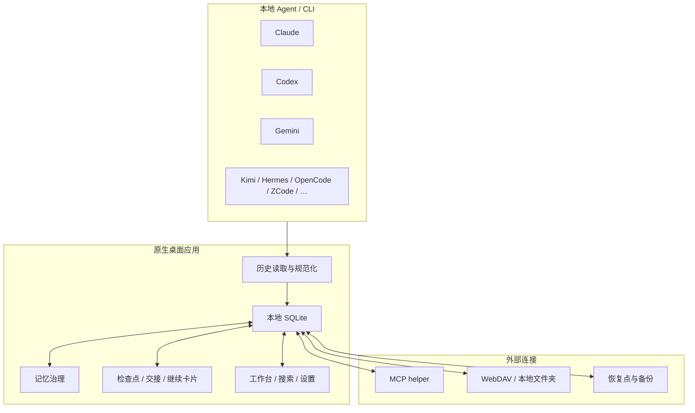

# 架构设计

AI Memory 采用“共享行为、平台原生实现”的双端架构。macOS 与 Windows 对数据模型、同步协议和用户流程保持一致，但分别使用 Apple 与 Microsoft 官方技术栈。

## macOS

- SwiftUI 负责页面、布局和状态展示；
- AppKit 负责主菜单、状态栏、窗口生命周期和原生文本系统；
- `AppStore` 是 UI 的主要状态源，避免 SwiftUI/AppKit 维护两份业务状态；
- SQLite 读写在独立存储对象中执行，大批量同步不长期阻塞主线程；
- Keychain 存储 WebDAV 密码；
- ServiceManagement 实现用户可控的登录启动；
- MCP helper 作为 App Bundle 内独立 stdio 可执行文件运行。

## Windows

- WinUI 3 负责 Windows 11 桌面界面；
- Windows App SDK `AppInstance` 负责单实例和窗口恢复；
- `AIMemory.Core` 封装 SQLite、同步、备份、历史导入和记忆治理；
- PasswordVault 保存 WebDAV 凭据；
- StartupTask 实现登录启动开关；
- MCP helper 作为独立 `.exe` 随 MSIX 打包。

## 数据边界

- AI Memory 使用自己的应用目录、Bundle/Package identity 和凭据命名空间；
- ChatMem 导入只读打开源数据库，校验后才原子替换 AI Memory 副本；
- Agent 历史读取以只读为默认；
- 支持写入的迁移目标必须通过“写入、回读、列表可见”验证；
- 不安全或不支持写回的来源不会伪装成可迁移目标。

## 同步协议

同步清单记录每条会话的标识、更新时间和内容哈希。双向同步比较本地与远端清单：

1. 仅本地存在：上传；
2. 仅远端存在：下载；
3. 两侧哈希相同：跳过；
4. 两侧都变化：按协议规则合并或报告冲突；
5. 写入使用临时文件与原子替换，避免部分文件成为有效数据。
